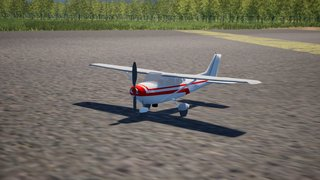
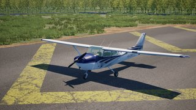
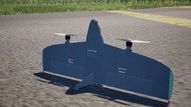
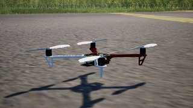
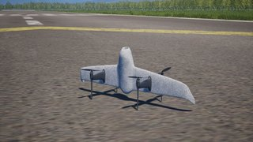
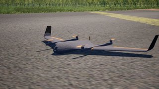
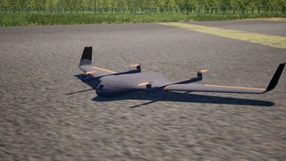
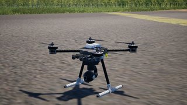
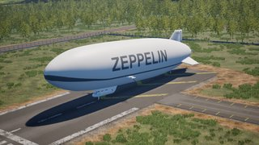

# PteroSimAircrafts

A collection of configurable aircraft models for PteroSim. Each directory contains a
JSBSim flight-dynamics definition, control bindings, visual meshes, and, where needed,
an autopilot profile. PteroSim reads these files when spawning a configurable aircraft.

## Installing into a PteroSim release

Clone or unpack this repository as `PteroSimAircrafts` **at the root of an unpacked
PteroSim release**. It must sit next to `Binaries`, `Content`, and `Plugins`, not inside
any of them:

```text
PteroSim-vX.Y.Z-Windows/
└── PteroSim/
    ├── Binaries/
    ├── Content/
    ├── Plugins/
    └── PteroSimAircrafts/  ← this repository
        ├── x500/
        ├── F450/
        └── ...
```

The directory name matters: PteroSim uses it as the lookup directory for user-authored
aircraft. Restart PteroSim, or respawn the aircraft, after replacing or updating files
so JSBSim loads the new definition.

## Aircraft

| Preview | Directory | Model | Summary |
| --- | --- | --- | --- |
|  | `advanced_plane` | Fixed-wing aircraft | A pusher-prop aircraft with wheeled landing gear, elevons, rudder, and flaps. |
|  | `c172x` | Cessna 172P Skyhawk | A four-seat single-piston trainer with tricycle gear, flaps, and PX4 and ArduPlane profiles; its meshes are FlightGear's c172p. |
|  | `explora` | eXplora Tailsitter VTOL | A 3D-printed dual-motor tailsitter flying wing with two elevons, built from the open-source eXplora design files, with ArduPlane and PX4 profiles. |
|  | `F450` | DJI F450 | A baseline quadcopter using an F450 frame, DJI E305 motors, and 9450 propellers. |
|  | `quadtailsitter` | Quad tailsitter | A tailsitter VTOL: it takes off and lands vertically, then flies forward like a fixed-wing aircraft. |
|  | `standard_vtol` | Standard VTOL | A fixed-wing VTOL with four lift rotors and a separate pusher propeller. |
|  | `tiltrotor` | Tiltrotor | A convertible aircraft with tilting nacelles: rotor mode for take-off and fixed-wing mode for forward flight. |
|  | `x500` | X500 | An X500 quadcopter with a CGO3 camera gimbal, PX4 and ArduPilot profiles, and a Python manual-flight pilot. |
|  | `ZLT-NT` | Zeppelin NT | A Zeppelin NT airship with three steerable engine nacelles, plus manual and automatic flight scripts. |

## Contents of an aircraft directory

The main XML file (`<model>.xml`) assembles a JSBSim model from mass, aerodynamic,
landing-gear, engine, sensor, and control definitions. `Visual.xml` references the
meshes in `meshes/` and describes their moving parts. Additional files provide the
control, sensor, and supported-autopilot configuration for the model.

Third-party licences and notices remain in the directories of the relevant aircraft.

## Credits

- `explora` is derived from the [eXplora Tailsitter VTOL](https://github.com/robustini/eXploraVTOL) by
  Marco Robustini (concept design, tuning and flight tests), Davide Silimbani (3D design), Roberto Casoni,
  Edoardo Nunzi, Lorenzo Franco, Antonios Antzoulatos and Brandon MacDougall, licensed under the GNU GPL v3.0.
  Its geometry and meshes come from that project's STEP files, its masses from the 3MF projects and bill of
  materials, and its ArduPlane setup from the published parameter file. `explora/NOTICE` lists every source.
- `c172x` joins JSBSim's c172x flight model by Tony Peden and FlightGear's c172p meshes by David Megginson and
  the c172p team, both under the GNU GPL. `c172x/NOTICE` lists every source.
